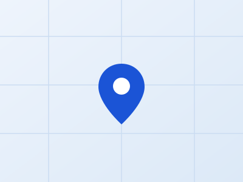

# 삼원 홈페이지 (템플릿 기반) 관리 가이드

상단 메뉴를 누르면 실제로 다른 HTML 파일로 이동하는 **다중 페이지 구조**입니다.
회사소개·제품안내처럼 하위 항목이 있는 영역은 페이지 좌측에 **사각형 박스형
소분류 이동 메뉴**가 있어서, 같은 대분류 안의 다른 페이지로 바로 이동할 수
있습니다.

jQuery, GSAP, Swiper가 전부 `resources/js/plugin.js` 안에 번들되어 있어서
별도 설치 없이 GitHub Pages에 그대로 올리면 동작합니다.

## 페이지 구성 (총 11개)

| 파일 | 내용 | 좌측 소분류 메뉴 |
|---|---|---|
| `index.html` | 홈 — 히어로(클릭 시 팝업) + 신뢰 배지 마퀴 + 왜 삼원인가 미리보기 + 제품 카테고리 타일 | 없음 |
| `about.html` | 회사소개 &gt; 회사개요 + 왜 삼원인가 | 회사개요 / 인사말 / 회사 연혁 |
| `about-greeting.html` | 회사소개 &gt; 인사말 (대표이사 사진 포함) | 〃 |
| `about-history.html` | 회사소개 &gt; 회사 연혁 (세로 타임라인) | 〃 |
| `products.html` | 제품안내 &gt; 전선관 본품 품목표 (CD-PIPE·HI-PIPE·PE평활관·ELP·FC통신관) | 본품 1 / 부속자재 5 |
| `products-cd.html` | 제품안내 &gt; CD관 부속자재 품목표 | 〃 |
| `products-hi.html` | 제품안내 &gt; HI관 부속자재 품목표 | 〃 |
| `products-elp.html` | 제품안내 &gt; ELP관 부속자재 품목표 | 〃 |
| `products-waterproof.html` | 제품안내 &gt; 관로구방수장치·연결부속 품목표 | 〃 |
| `products-etc.html` | 제품안내 &gt; 기타 부속자재 품목표 | 〃 |
| `contact.html` | 오시는 길(지도·주소) + 문의하기(연락처) 통합 페이지 | 없음 |

상단 메가메뉴(PC)와 모바일 풀메뉴 모두 이 11개 페이지로 정확히 연결되어
있습니다. "오시는 길"과 "문의하기"는 같은 `contact.html` 파일 안의 서로 다른
섹션(`#location-section`, `#contact-section`)으로 연결됩니다. 지금 보고 있는
대분류 메뉴는 파란 밑줄로, 좌측 소분류 메뉴는 파란 배경으로 현재 위치가
표시됩니다.

## 파일 구성

```
index.html, about.html, about-greeting.html, about-history.html,
products.html, products-cd.html, products-hi.html, products-elp.html,
products-waterproof.html, products-etc.html,
contact.html      ← 11개 페이지
resources/
  css/
    setting.css                ← 폰트, 기본 변수 (거의 수정 불필요)
    plugin.css                 ← Swiper 등 라이브러리 스타일 (수정 금지)
    templatehouse.css          ← 프레임워크 공통 스타일 (수정 금지)
    style.css                  ← 섹션별 레이아웃 스타일 (원본, 수정 비권장)
    site-overrides.css         ← 삼원 브랜드 색상 · 로고 · 소분류 박스 등
                                   (여기를 수정하세요)
  js/
    plugin.js                  ← jQuery + GSAP + Swiper 번들 (수정 금지)
    templatehouse.js, style.js, setting.js  ← 탭/슬라이드 동작 로직 (수정 금지)
    site-custom.js              ← 홈페이지 추가 섹션의 스크롤 애니메이션 (여기서 확장하세요)
  images/
    logo.png, logo_w.png       ← 헤더/푸터 로고
  images_custom/                ← 블루 톤 배경 이미지 (히어로, 회사소개 아이콘)
  icons_custom/                 ← 체크포인트 아이콘, 제품 규격 다이어그램
  icons/                        ← 템플릿 기본 아이콘 (네이버/카카오 지도, 닫기 등)
```

**절대 건드리면 안 되는 파일**: `plugin.js`, `templatehouse.js`, `style.js`,
`setting.js`, `templatehouse.css`, `plugin.css` — 이 파일들이 탭 전환, 슬라이드,
모바일 메뉴 등 모든 동작을 담당합니다. 여기를 수정하면 11개 페이지 전부에서
동작이 깨질 수 있어요.

**색상을 바꾸고 싶다면** `site-overrides.css`의 `:root` 안 `--primary`,
`--secondary` 값만 바꾸면 버튼·포인트 색상이 11개 페이지 전체에서 한 번에
바뀝니다.

---

## 홈페이지 구성 (히어로 팝업 · 마퀴 · 미리보기 · 타일)

`index.html`은 히어로 아래로 다음 순서로 구성되어 있습니다:

0. **히어로 슬라이드** — 슬라이드를 클릭하면 다른 페이지로 이동하지 않고
   **팝업창(모달)**이 열려서 간단한 설명을 보여줍니다. 팝업 안의 버튼을
   눌러야 실제 페이지로 이동합니다. 슬라이드별 팝업 내용은 `index.html`에서
   `data-modal-id="hero-modal-1"`(2, 3)로 찾을 수 있습니다.
1. **신뢰 배지 마퀴** — "KS 인증", "난연 2급 인증" 같은 문구가 좌우로 끊임없이
   흐르는 띠입니다. 실제 거래처 수 같은 과장하기 쉬운 숫자 대신, 사실에
   기반한 인증·품질 관련 문구로 채웠습니다. 문구를 바꾸려면 `trust-marquee-track`
   안의 `<span>` 목록을 수정하면 됩니다 (앞뒤로 두 번 반복되어 있어야 끊김
   없이 흐릅니다 — 하나를 고치면 반복된 두 곳 모두 똑같이 고쳐주세요).
2. **왜 삼원인가 미리보기** — `about.html`의 체크포인트 중 3가지를 뽑아 카드로
   보여주고, "더 알아보기" 버튼으로 연결했습니다. 스크롤해서 화면에 들어오면
   아래에서 위로 살짝 올라오며 나타나는 애니메이션이 적용되어 있어요.
3. **제품 카테고리 바로가기 타일** — 제품안내 6개 페이지로 바로 이동하는
   타일입니다. 마우스를 올리면 살짝 떠오르고 아이콘이 회전하는 효과가 있어요.

이 애니메이션은 `class="reveal-up"`이 붙은 요소라면 어디에나 적용됩니다.
새 섹션에도 같은 효과를 쓰고 싶다면 해당 요소에 `reveal-up` 클래스만
추가하면 되고, `resources/js/site-custom.js`는 수정할 필요 없습니다.

> 원래 맨 아래 있던 "현장에 필요한 자재, 지금 문의하세요" CTA 배너는
> `contact.html`의 연락처 안내와 내용이 겹쳐서 삭제했습니다.

---

## 서브 페이지 상단 배너

헤더가 항상 고정되어 있다 보니, 배너 없이 바로 본문이 시작되면 내용이 헤더에
너무 가깝게 붙어 보이는 문제가 있었습니다. 그래서 `about.html`, `products.html`
등 홈을 제외한 8개 페이지 전부에 그라디언트 배경 + 아이콘 + 페이지 제목으로
구성된 짧은 배너를 넣어서, 본문이 시작되는 위치를 화면 중간쯤으로 자연스럽게
내렸습니다.

```html
<div class="page-banner">
  <div class="page-banner-icon">
    
  </div>
  <div class="page-banner-inner container-md">
    <span class="page-banner-eyebrow">HISTORY</span>
    <h1 class="page-banner-title">회사 연혁</h1>
  </div>
</div>
```

제목이나 아이콘을 바꾸려면 해당 페이지에서 `page-banner-eyebrow`(영문 라벨),
`page-banner-title`(제목), `page-banner-icon` 안의 `src` 경로를 수정하면
됩니다. 아이콘은 `icons_custom` 폴더 안의 SVG 파일 아무거나 써도 되고, 실제
사진을 넣고 싶다면 같은 자리에 사진 파일 경로로 바꿔주면 됩니다 (배경이
진한 남색이라 밝은 톤 사진이 잘 어울립니다).

---

## 소분류 이동 박스 (좌측 사각형 메뉴)

`about.html`, `products.html` 등 하위 항목이 있는 페이지에는 이런 구조가
들어있습니다:

```html
<aside class="subnav-box">
  <div class="subnav-title">회사소개</div>
  <ul class="subnav-list">
    <li><a class="active" href="about.html">회사개요</a></li>
    <li><a href="about-greeting.html">인사말</a></li>
    <li><a href="about-history.html">회사 연혁</a></li>
  </ul>
</aside>
```

- 현재 페이지에 해당하는 `<a>`에 `class="active"`를 넣으면 파란 배경으로
  강조됩니다.
- 새 소분류를 추가하려면: ① 새 HTML 파일을 만들고 ② **같은 그룹의 모든
  페이지**(회사소개라면 3개 파일 전부)의 `subnav-list`에 `<li>` 항목을
  똑같이 추가해야 합니다. 한 파일에만 추가하면 페이지마다 메뉴가 달라 보여요.

---

## 회사 연혁 항목 추가하는 방법 (세로 타임라인 디자인)

`about-history.html`에서 아래 형태를 복사해서 원하는 위치에 추가하면 됩니다
(최신 연도가 위로 오도록 정렬되어 있어요):

```html
<div class="timeline-row reveal-up">
  <div class="timeline-dot">2027</div>
  <div class="timeline-card">
    <strong>태그(영문 라벨)</strong>
    <p>새로운 소식을 여기에 입력</p>
  </div>
</div>
```

`<strong>` 안의 영문 태그(NEW, CERTIFICATION 등)는 짧은 카테고리 표시용이라
비워둬도 되고, 원하는 단어로 바꿔도 됩니다.

## 인사말 문구 · 대표이사 사진 수정하는 방법

`about-greeting.html`에서 `greeting-lead`(첫 인사말 한 줄), `greeting-desc`
안의 `<p>` 문단들, 하단의 대표이사 이름을 찾아 바꾸면 됩니다.

우측 상단 사진 자리는 `images_custom` 폴더에 `ceo-photo.jpg`라는 이름으로
사진을 올리기만 하면 자동으로 채워집니다 (지금은 파일이 없어서 "대표이사
사진 준비중입니다" 안내만 보여요). 다른 파일명을 쓰고 싶다면
`about-greeting.html`의 `
  <td class="col-item">품목명</td>
  <td class="col-size"><span class="size-chip">16C</span><span class="size-chip">22C</span></td>
  <td class="col-note">비고(없으면 -)</td>
</tr>
```

- 품목을 추가하려면 `<tr>...</tr>` 한 덩어리를 복사해서 `<tbody>` 안에 붙여넣고 내용만 바꾸세요.
  규격을 추가·삭제할 때는 `<span class="size-chip">규격값</span>`을 통째로 복사하거나 지우면 됩니다.
- 품목이 본품인지 부속자재인지 애매하면, 관 자체(파이프)는 `products.html`(본품)에,
  그 외 부품류는 해당 관 종류의 부속자재 페이지에 넣으면 됩니다.
- 제품 상세 설명이나 사진을 넣고 싶으시면 알려주시면 이 표에 맞춰 반영해드릴게요.
- 새 카테고리(페이지)를 추가하려면 6개 제품 페이지 전부의 좌측 소분류 메뉴와
  헤더 메뉴(PC용·모바일용)에 링크를 똑같이 추가해야 합니다. 본품 그룹에 추가할지
  부속자재 그룹에 추가할지도 함께 정해주세요.

---

## 사진 교체하는 방법

지금은 실제 사진이 없어서 **블루 톤 그라디언트 이미지**로 자리를 채워뒀습니다
(`images_custom/`, `icons_custom/` 폴더). 실제 사진이 생기면 해당 파일을
같은 이름으로 덮어쓰거나, HTML의 `src` 경로를 새 파일명으로 교체해주세요.
가로세로 비율은 정사각형(1:1)에 가까운 사진이 가장 잘 맞습니다.

---

## GitHub Pages에 올리는 방법

1. [github.com](https://github.com)에서 새 저장소 생성 (Public)
2. 11개 HTML 파일과 `resources` 폴더 전체를 저장소 루트에 업로드
   (`Add file` → `Upload files`, 폴더째로 드래그)
3. 저장소 `Settings` → `Pages` → Branch를 `main` / `/(root)`로 설정 → Save
4. 1~2분 후 `https://내아이디.github.io/저장소이름/` 주소로 접속

---

## 오시는 길 · 문의하기 통합 페이지 (개인정보 미수집 방식)

"오시는 길"과 "문의하기"는 `contact.html` 한 페이지 안에 **좌측 지도 / 우측
주소+연락처**로 함께 들어있습니다. 우측 칼럼은 위에서부터 주소 → 연락처
카드(TEL/EMAIL) → 안내 문구 순서로, 연락처가 화면 상단 가까이 보이도록
배치했습니다. 상단 메뉴에서 "오시는 길"이나 "문의하기" 중 아무거나 눌러도
이 페이지로 이동하고, "문의하기"는 연락처 카드 위치로 자동 스크롤됩니다.

보안을 위해 이름·연락처 등을 입력받는 문의 양식은 두지 않았습니다. 전화번호와
이메일을 보여주는 **연락 카드**만 있고, 클릭해도 전화 앱이나 메일 앱이 열리지
않는 단순 텍스트 표시입니다 (탭하면 앱 선택 팝업이 뜨는 것도 원치 않으신다는
요청에 따라, 일부러 클릭 동작 없이 정보만 보이도록 만들었습니다). 방문자가
번호나 주소를 직접 보고 입력해 연락하는 방식이라, 홈페이지 자체는 어떤
개인정보도 입력받거나 저장하지 않습니다.

전화번호나 이메일을 바꾸고 싶다면 `contact.html`에서 아래 부분을 찾아
수정하면 됩니다:

```html
<div class="contact-direct-card">
  <span class="cd-label mono">TEL</span>
  <strong class="h4">031-795-0616</strong>
  ...
```

같은 이유로 원래 템플릿에 있던 개인정보 수집동의 체크박스, 개인정보
처리방침 모달, 이메일 무단수집 거부 안내 등 개인정보 관련 내용은 전체
페이지에서 삭제했습니다.

---

## 오시는 길 지도 교체·링크 수정하기

지금은 지도 자리에 블루 톤 플레이스홀더 이미지(`map_thumb.svg`)가 들어있습니다.
실제 지도 캡처 이미지를 받으면 `contact.html`의 아래 부분에서 파일 경로만
바꾸면 됩니다:

```html

```

네이버·카카오 지도 링크를 더 정확하게 연결하고 싶다면:

1. [네이버 지도](https://map.naver.com)에서 정확한 위치 검색 → `공유` → 단축 URL 복사
2. [카카오맵](https://map.kakao.com)에서도 동일하게 단축 URL 복사
3. `contact.html`(`#location-section` 부분)의 `href="https://map.naver.com/..."`,
   `href="https://map.kakao.com/..."` 부분을 복사한 단축 URL로 교체

---

## 회사 정보 수정하는 방법

전화번호(`031-795-0616`), 이메일(`isamwon@naver.com`), 주소(`경기도 하남시
하산곡동로 106번길 64`)는 **11개 페이지 전부**의 헤더·푸터에 공통으로
들어있고, `contact.html`에는 오시는 길·연락 카드에도 들어있습니다. 파일마다
브라우저의 찾기(Ctrl+F / Cmd+F)로 옛 값을 검색해 하나씩 바꿔주세요.

---

## 자주 묻는 질문

- **탭을 눌러도 화면이 안 바뀌어요** → `resources/js/` 폴더 전체가 함께
  업로드됐는지 확인해주세요.
- **로고 색이 이상하게 보여요** → 헤더가 맨 위(사진 위 투명 상태)에 있을 때
  로고 색이 반전되던 원본 템플릿 효과는 `site-overrides.css`에서 이미
  꺼뒀습니다. 그래도 이상하면 이 파일이 제대로 업로드됐는지 확인해주세요.
- **상단 네비게이션 바 색이 스크롤에 따라 바뀌었으면 좋겠어요** → 지금은
  요청에 따라 항상 흰색으로 고정되어 있습니다. `site-overrides.css`에서
  "네비게이션 바 색상 고정" 부분을 지우면 원래 템플릿의 투명→흰색 전환
  효과로 되돌릴 수 있습니다.
- **소분류 메뉴에서 현재 페이지가 강조 표시 안 돼요** → 해당 `<a>` 태그에
  `class="active"`가 붙어 있는지 확인해주세요.
- **수정한 내용이 사이트에 안 보여요** → 저장(Commit) 후 1~2분 기다렸다가
  강력 새로고침(Ctrl+Shift+R / Cmd+Shift+R) 해보세요.
